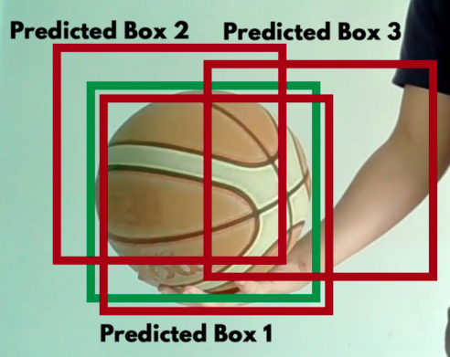

# IOT project
## Objects Detection and counting 
This IOT project consist on detecting and counting objects in real time using the webcam.
For this matter we need to install some librairies on our Ubuntu 20.04  which are: 
- Python3
- OpenCV
- YOLOv3 

  


## Installation 
### Installation of openCV
OpenCV (Open Source Computer Vision Library) is an open-source computer vision library with bindings for C++, Python, and Java and supports all major operating systems. It can take advantage of multi-core processing and features GPU acceleration for real-time operation.

```sh
sudo apt update
sudo apt install libopencv-dev python3-opencv
```

### Installation of Darknet
You only look once (YOLO) is a real-time object detection system. On a Pascal Titan X it processes images at 30 FPS and has a mAP of 57.9% on COCO test-dev. There are several ways of using YOLO, the original way, is through Darknet.
Darknet is an open source neural network framework written in C and CUDA. It is fast, easy to install, and supports CPU and GPU computation.Darknet prints out the objects it detected, its confidence, and how long it took to find them.
To download a pre-trained model: 
```sh
git clone https://github.com/pjreddie/darknet
cd darknet
make
```
You already have the config file for YOLO in the cfg/ subdirectory. You will have to download the pre-trained weight file by running the following command:

```sh
wget https://pjreddie.com/media/files/yolov3.weights
```
To make sure that everything is compiled correctly, try running this 
```sh
./darknet
```
You should get the output:
> usage: ./darknet <function>
   
   ## YOLO algorithm 

YOLO — You Only Look Once — is an extremely fast multi object detection algorithm which uses convolutional neural network (CNN) to detect and identify objects.

### YOLO V3
YOLO v3 uses a variant of Darknet, which originally has 53 layer network trained on Imagenet. For the task of detection, 53 more layers are stacked onto it, giving us a 106 layer fully convolutional underlying architecture for YOLO v3.


### Detection at three Scales 
The most salient feature of v3 is that it makes detections at three different scales. 

the detection is done by applying 1 x 1 detection kernels on feature maps of three different sizes at three different places in the network :
- Layer 82
- Layer 94
- Layer 106

The shape of the detection kernel is 1 x 1 x (B x (5 + C) ). Here B is the number of bounding boxes a cell on the feature map can predict, “5” is for the 4 bounding box attributes and one object confidence, and C is the number of classes. 
In YOLO v3 trained on COCO, B = 3 and C = 80, so the kernel size is 1 x 1 x 255.


So , for each object , the algorithm draws three boxes, and for each box there is a prediction value.

At the end , the algorithm chooses the box with the highest prediction value for each object.

   
   


## Useful links
   - https://towardsdatascience.com/yolo-v3-object-detection-53fb7d3bfe6b
   - https://opencv-tutorial.readthedocs.io/en/latest/yolo/yolo.html
   - https://blog.paperspace.com/how-to-implement-a-yolo-object-detector-in-pytorch/
   - https://pjreddie.com/darknet/install/#cuda 
   - https://linuxize.com/post/how-to-install-opencv-on-ubuntu-20-04/
  

